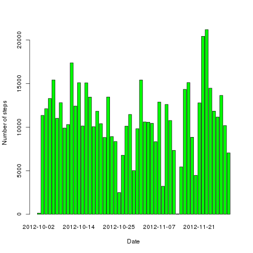
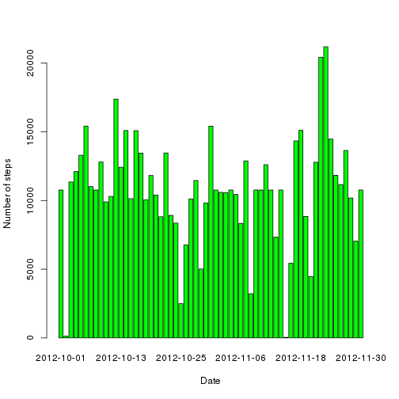
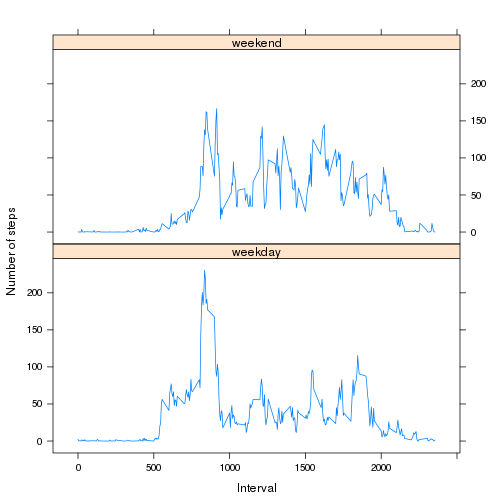

Reproducible Research Peer Assessment 1
=======================================

Submitted by Pitono Saubari.

This is my R markdown file for Reproducible Research Peer Assessment 1.

The following code will load data from csv file. It also convert date column into date format suitable for later processing. The data is loaded into data frame.


```r
data <- read.csv("activity.csv", header = TRUE, sep = ",")
data$date <- as.Date(data$date, "%Y-%m-%d")
data1.df <- as.data.frame(data)
```


Here we see the structure and summary of loaded dataset.


```r
str(data1.df)
```

```
## 'data.frame':	17568 obs. of  3 variables:
##  $ steps   : int  NA NA NA NA NA NA NA NA NA NA ...
##  $ date    : Date, format: "2012-10-01" "2012-10-01" ...
##  $ interval: int  0 5 10 15 20 25 30 35 40 45 ...
```

```r
summary(data1.df)
```

```
##      steps            date               interval   
##  Min.   :  0.0   Min.   :2012-10-01   Min.   :   0  
##  1st Qu.:  0.0   1st Qu.:2012-10-16   1st Qu.: 589  
##  Median :  0.0   Median :2012-10-31   Median :1178  
##  Mean   : 37.4   Mean   :2012-10-31   Mean   :1178  
##  3rd Qu.: 12.0   3rd Qu.:2012-11-15   3rd Qu.:1766  
##  Max.   :806.0   Max.   :2012-11-30   Max.   :2355  
##  NA's   :2304
```


## First question to answer is what is mean total number of steps taken per day? 

We create a new aggregate data frame where all steps each day is being added. Missing value in the dataset will be ignored. 


```r
agg1 <- aggregate(data1.df$step ~ data1.df$date, data = data1.df, FUN = sum, 
    na.rm = TRUE)
colnames(agg1) <- c("date", "steps")
```


We plot histogram of the total number of steps taken each day.


```r
barplot(agg1$steps, names.arg = agg1$date, col = "green", xlab = "Date", ylab = "Number of steps")
```

 


The mean of total number of steps taken per day. Here we use sprintf to display precision.


```r
sprintf("%.2f", mean(agg1$steps))
```

```
## [1] "10766.19"
```


The median of total number of steps taken per day.


```r
median(agg1$steps)
```

```
## [1] 10765
```


## Second question to answer is what is the average daily activity pattern?

First we pre-allocate data frame to hold summary data. We then loop through all interval to calculate average of steps taken, averaged accross all days. 


```r
agg2 <- data.frame(interval = numeric(288), average_steps = numeric(288))
i <- 1
for (j in seq(0, 2300, by = 100)) {
    for (k in seq(0, 55, by = 5)) {
        interval_val = j + k
        d1 <- subset(data1.df, interval == interval_val & !is.na(steps))
        average_steps = mean(d1$steps)
        agg2[i, ] <- c(interval_val, average_steps)
        i <- i + 1
    }
}
```


We create time series plot. X-axis is 5-minute interval and y-axis is average number of steps taken, averaged across all days.


```r
plot(agg2$interval, agg2$average_steps, type = "l", xlab = "Interval", ylab = "Number of steps")
```

 


From the plot above, we could see that there are interval with maximum number of steps. To get the interval, we subset the dataset.


```r
d2 <- agg2[agg2$average_steps == max(agg2$average_steps), ]
d2$interval
```

```
## [1] 835
```


Hence the maximum number of steps is in the interval 8:35.

## Third question to answer is inputting missing values.

First we need to find out how many rows has missing values 


```r
nrow(data1.df[is.na(data1.df$steps), ])
```

```
## [1] 2304
```


As for strategy to fill missing values, we will use mean (averaged across all days) for the missing values in the 5 minute interval.

First we will create a new data frame as a copy of the loaded data from csv. We also create a new column "normalized_steps" to hold values of either the actual number of steps or the average number of steps (if the value is missing). Currently it is set to actual number of steps.


```r
data2.df = as.data.frame(data)
data2.df$normalized_steps <- data2.df$steps
```


Looping through data in month of October and check if steps column has missing values. If it does, then put average of steps, averaged across all days in normalized_steps column


```r
for (i in seq(1, 31, by = 1)) {
    for (j in seq(0, 2300, by = 100)) {
        for (k in seq(0, 55, by = 5)) {
            interval_val = j + k
            d2 <- data2.df[data2.df$date == as.Date(sprintf("2012-10-%02d", 
                i), "%Y-%m-%d") & data2.df$interval == interval_val, ]
            if (is.na(d2$steps)) {
                data2.df[data2.df$date == as.Date(sprintf("2012-10-%02d", i), 
                  "%Y-%m-%d") & data2.df$interval == interval_val, c("normalized_steps")] <- agg2[agg2$interval == 
                  interval_val, c("average_steps")]
            }
        }
    }
}
```


Looping through data in month of November and check if steps column has missing values. If it does, then put average of steps, averaged across all days in normalized_steps column


```r
for (i in seq(1, 30, by = 1)) {
    for (j in seq(0, 2300, by = 100)) {
        for (k in seq(0, 55, by = 5)) {
            interval_val = j + k
            d2 <- data2.df[data2.df$date == as.Date(sprintf("2012-11-%02d", 
                i), "%Y-%m-%d") & data2.df$interval == interval_val, ]
            if (is.na(d2$steps)) {
                data2.df[data2.df$date == as.Date(sprintf("2012-11-%02d", i), 
                  "%Y-%m-%d") & data2.df$interval == interval_val, c("normalized_steps")] <- agg2[agg2$interval == 
                  interval_val, c("average_steps")]
            }
        }
    }
}
```


At this point we had a new dataset equal to original dataset but with the missing data filled in. 

Here we see the structure and summary of the new dataset.


```r
str(data2.df)
```

```
## 'data.frame':	17568 obs. of  4 variables:
##  $ steps           : int  NA NA NA NA NA NA NA NA NA NA ...
##  $ date            : Date, format: "2012-10-01" "2012-10-01" ...
##  $ interval        : int  0 5 10 15 20 25 30 35 40 45 ...
##  $ normalized_steps: num  1.717 0.3396 0.1321 0.1509 0.0755 ...
```

```r
summary(data2.df)
```

```
##      steps            date               interval    normalized_steps
##  Min.   :  0.0   Min.   :2012-10-01   Min.   :   0   Min.   :  0.0   
##  1st Qu.:  0.0   1st Qu.:2012-10-16   1st Qu.: 589   1st Qu.:  0.0   
##  Median :  0.0   Median :2012-10-31   Median :1178   Median :  0.0   
##  Mean   : 37.4   Mean   :2012-10-31   Mean   :1178   Mean   : 37.4   
##  3rd Qu.: 12.0   3rd Qu.:2012-11-15   3rd Qu.:1766   3rd Qu.: 27.0   
##  Max.   :806.0   Max.   :2012-11-30   Max.   :2355   Max.   :806.0   
##  NA's   :2304
```


Next we create the aggregate data frame using normalized_steps column, and then plot it as histogram.


```r
agg3 <- aggregate(data2.df$normalized_steps ~ data2.df$date, data = data2.df, 
    FUN = sum, na.rm = TRUE)
colnames(agg3) <- c("date", "steps")
barplot(agg3$steps, names.arg = agg3$date, col = "green", xlab = "Date", ylab = "Number of steps")
```

 


The mean of total number of steps taken per day of the new dataset. Here we use sprintf to display precision.


```r
sprintf("%.2f", mean(agg3$steps))
```

```
## [1] "10766.19"
```


The median of total number of steps taken per day of the new dataset.


```r
median(agg3$steps)
```

```
## [1] 10766
```


The mean of the new dataset is not different than the original dataset. It is probably due to the fact that we use average / mean steps to fill the missing values.

The median of the new dataset is different than the original dataset. Hence filling missing value will change the median.

## Fourth question to answer is are there differences in activity patterns between weekdays and weekends?

We create a new factor variable in the dataset with two levels "weekday" and "weekend" indicating whether a given date is a weekday or weekend day. The default is set as weekday.


```r
data2.df$day <- weekdays(data2.df$date)
data2.df$day_type <- "weekday"
```


If the day is Saturday or Sunday, then we set as weekend.


```r
data2.df[data2.df$day == "Saturday" | data2.df$day == "Sunday", c("day_type")] <- "weekend"
```


Here we see the structure and summary of dataset with new factor variable indicating if the given date is weekday or weekend day.


```r
str(data2.df)
```

```
## 'data.frame':	17568 obs. of  6 variables:
##  $ steps           : int  NA NA NA NA NA NA NA NA NA NA ...
##  $ date            : Date, format: "2012-10-01" "2012-10-01" ...
##  $ interval        : int  0 5 10 15 20 25 30 35 40 45 ...
##  $ normalized_steps: num  1.717 0.3396 0.1321 0.1509 0.0755 ...
##  $ day             : chr  "Monday" "Monday" "Monday" "Monday" ...
##  $ day_type        : chr  "weekday" "weekday" "weekday" "weekday" ...
```

```r
summary(data2.df)
```

```
##      steps            date               interval    normalized_steps
##  Min.   :  0.0   Min.   :2012-10-01   Min.   :   0   Min.   :  0.0   
##  1st Qu.:  0.0   1st Qu.:2012-10-16   1st Qu.: 589   1st Qu.:  0.0   
##  Median :  0.0   Median :2012-10-31   Median :1178   Median :  0.0   
##  Mean   : 37.4   Mean   :2012-10-31   Mean   :1178   Mean   : 37.4   
##  3rd Qu.: 12.0   3rd Qu.:2012-11-15   3rd Qu.:1766   3rd Qu.: 27.0   
##  Max.   :806.0   Max.   :2012-11-30   Max.   :2355   Max.   :806.0   
##  NA's   :2304                                                        
##      day              day_type        
##  Length:17568       Length:17568      
##  Class :character   Class :character  
##  Mode  :character   Mode  :character  
##                                       
##                                       
##                                       
## 
```


Next we create new data frame to hold average of number of steps, averaged across all week days.


```r
agg4_wd <- data.frame(interval = numeric(288), average_steps = numeric(288))
i <- 1
for (j in seq(0, 2300, by = 100)) {
    for (k in seq(0, 55, by = 5)) {
        interval_val = j + k
        d4 <- subset(data2.df, interval == interval_val & day_type == "weekday" & 
            !is.na(normalized_steps))
        average_steps = mean(d4$normalized_steps)
        agg4_wd[i, ] <- c(interval_val, average_steps)
        i <- i + 1
    }
}
agg4_wd$day_type <- "weekday"
```


Next we create new data frame to hold average of number of steps, averaged across all weekends.


```r
agg4_we <- data.frame(interval = numeric(288), average_steps = numeric(288))
i <- 1
for (j in seq(0, 2300, by = 100)) {
    for (k in seq(0, 55, by = 5)) {
        interval_val = j + k
        d4 <- subset(data2.df, interval == interval_val & day_type == "weekend" & 
            !is.na(normalized_steps))
        average_steps = mean(d4$normalized_steps)
        agg4_we[i, ] <- c(interval_val, average_steps)
        i <- i + 1
    }
}
agg4_we$day_type <- "weekend"
```


We then bind the 2 new dataset together


```r
agg4 <- rbind(agg4_wd, agg4_we)
```


This is to make sure the day_type column is still factor variable


```r
agg4 <- transform(agg4, day_type = factor(day_type))
```


Here we see the structure and summary of summary dataset.


```r
str(agg4)
```

```
## 'data.frame':	576 obs. of  3 variables:
##  $ interval     : num  0 5 10 15 20 25 30 35 40 45 ...
##  $ average_steps: num  2.251 0.445 0.173 0.198 0.099 ...
##  $ day_type     : Factor w/ 2 levels "weekday","weekend": 1 1 1 1 1 1 1 1 1 1 ...
```

```r
summary(agg4)
```

```
##     interval    average_steps       day_type  
##  Min.   :   0   Min.   :  0.00   weekday:288  
##  1st Qu.: 589   1st Qu.:  2.05   weekend:288  
##  Median :1178   Median : 28.13                
##  Mean   :1178   Mean   : 38.99                
##  3rd Qu.:1766   3rd Qu.: 61.26                
##  Max.   :2355   Max.   :230.38
```


We create panel plot for the dataset. X-axis is 5 minute interval and y-axis is the average number of steps taken averaged across all weekend or weekday on different panel


```r
library(lattice)
xyplot(average_steps ~ interval | day_type, data = agg4, type = "l", layout = c(1, 
    2), xlab = "Interval", ylab = "Number of steps")
```

 

